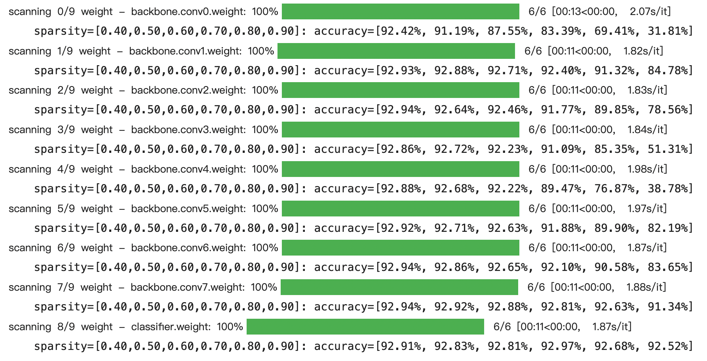
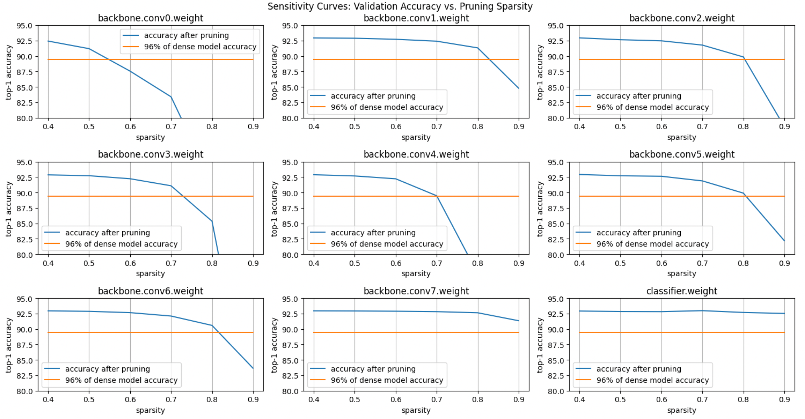
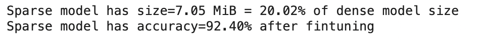
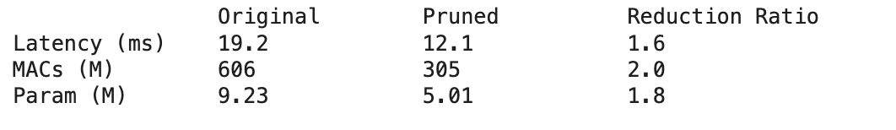

# Post-training Pruning
## Unstructured Pruning
### Magnitude-based Pruning

For each layer in VGG model, the relationship between sparsity and accuracy is as follows.

According to the result, we can draw the relationship for the conv and fc layer easily.

Finally, we choose some ratio of sparsity for each layer. And we can get a model with $accuracy=48.66%$. After fintuning which is a way for post training method, we can get the last result.

### Channel Pruning
By use Frobenius norm(L2-norm), sort the weight for every channel of each origin model's layer. For each layer of this model, we must preserve the channel which has high priority.

After fintuning, the result is as follows.
